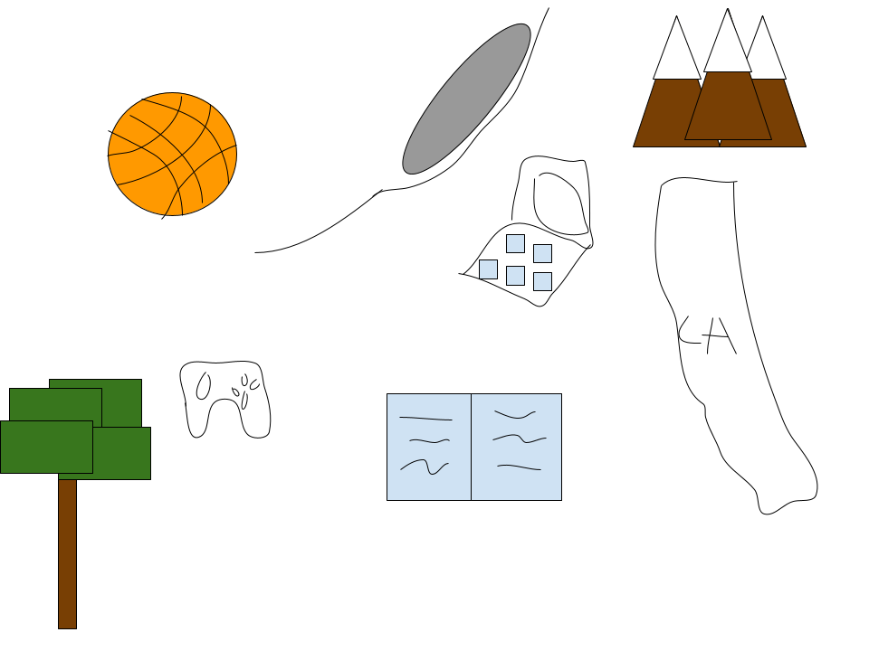
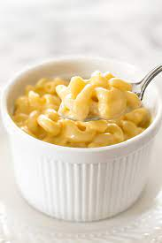

## Gurshawn's Page

<head>About Me:</head>

I am a fourteen year old sophmore who wants to learn more about computer science. I was born and raised in San Diego, but my parents are from Punjab.

<head>Favorite Food:</head>

<ul>
## Overview of Hacks, Study and Tangibles

1. make sure everything is working after each step.
   2. make sure all progmrams are updated
   3. get help from others who have encountered similair problems
   4. You have to use your github url to be able to commit. If you just clone the teacher sample you can only make changes onto  a local host. 

  Errors:
  Commit didn't work: The problem was that I had originally been using a git clone of the teacher repository rather than my own. Later the problem was that I was typing in wrong index file, so the commit wasn't recognized.  
  Image didn't work: When entering the picture, I learned I have to use the full file path, so the computer knows where to pull from. 
  Make command failed: The reason my make command didn't work was because some of the files I had downloaded were corrupted.

While I was setting up my enviornment for class I encountered many problems. Often times when I didn’t understand a command or where to locate a file or folder, I was able to rely on my teammates to explain it to me.

</ul>

Calculator

    

      <input type="text" id="display" disabled="" />
       
      <button onclick="appendToDisplay('1')">1</button>
      <button onclick="appendToDisplay('2')">2</button>
      <button onclick="appendToDisplay('3')">3</button>
      <button onclick="appendToDisplay('*')">x</button>
      <button onclick="appendToDisplay('+')">+</button>
      <button onclick="appendToDisplay('-')">-</button>
       
      <button onclick="appendToDisplay('4')">4</button>
      <button onclick="appendToDisplay('5')">5</button>
      <button onclick="appendToDisplay('6')">6</button>
      <button onclick="calculate()">=</button>
      <button onclick="appendToDisplay('/')">/</button>
      <button onclick="clearDisplay()">C</button>
       
      <button onclick="appendToDisplay('7')">7</button>
      <button onclick="appendToDisplay('8')">8</button>
      <button onclick="appendToDisplay('9')">9</button>
       
      <button onclick="appendToDisplay('0')">0</button>
    
    

    
    
  
    
    <head>
       
      <h1 span="" style="color: green; font-size: 20px;">Tic Tac Toe </h1>
      
    </head>
    <body>
      

        

        

        

        

        

        

        

        

        

      

    
      
    </body>

  

- Plans, Lists, [Scrum Boards](https://clickup.com/blog/scrum-board/) help you to track key events, show progress and record time.  Effort is a big part of your class grade.  Show plans and time spent!
- [Hacks(Todo)](https://levelup.gitconnected.com/six-ultimate-daily-hacks-for-every-programmer-60f5f10feae) enable you to stay in focus with key requirements of the class.  Each Hack will produce Tangibles.
- Tangibles or [Tangible Artifacts](https://en.wikipedia.org/wiki/Artifact_(software_development)) are things you accumulate as a learner and coder. 
